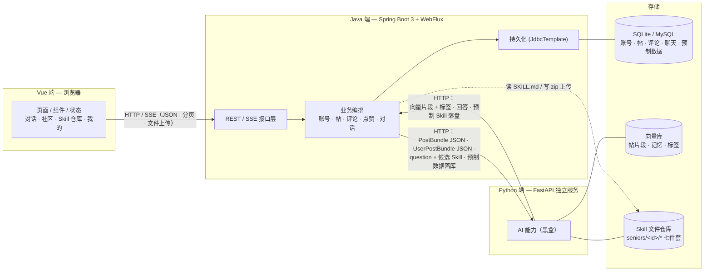

# 最终形态架构（TODO 对位）

> 对应 `Desktop/TODO.md` 的最终形态。三端：Vue（浏览器）、Java（Spring Boot 3）、Python（FastAPI，AI 服务）。
> Java 通过 HTTP 调 Python。Python 内部不展开。

## 总图

## TODO 对位

| # | TODO | 端 |
|---|---|---|
| 1 | 完整社区（账号 / 发帖 / 评论） | Vue + Java |
| 2 | 帖子分析 Agent → 向量库 | Python |
| 3 | 帖 / 用户帖 JSON 打包 | Java |
| 4 | RAG 召回 | Python |
| 5 | metaskill（生成 Skill 的 Skill） | Python（未展开） |
| 6 | 人格蒸馏流程 | Python（未展开） |
| 7 | 协作接口 / 数据结构 | Java + Python |
| 8 | 前端默认对话：选人 + RAG + 加载 | Vue + Java + Python |
| 9 | 方块视觉效果 | Vue |
| 10 | 分类器（片段打标签） | Python |
| 11 | 预制数据入库 | Java |
| 12 | 用 metaskill 蒸馏预制人 Skill | Python（未展开） |
